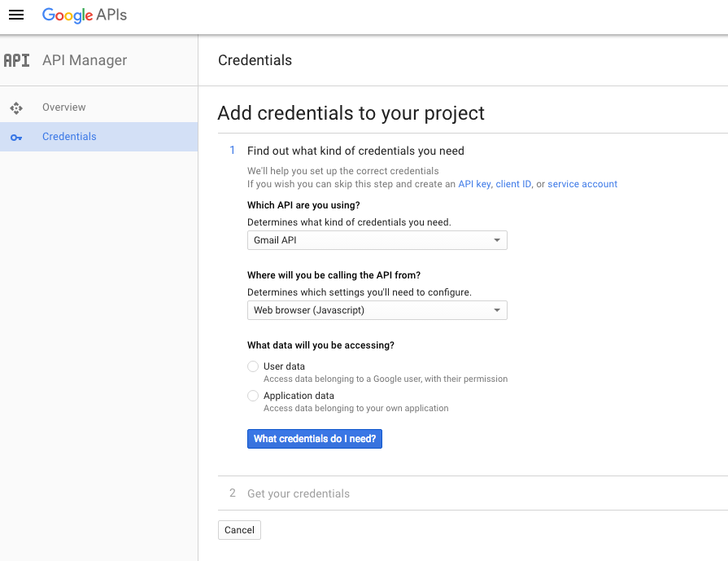
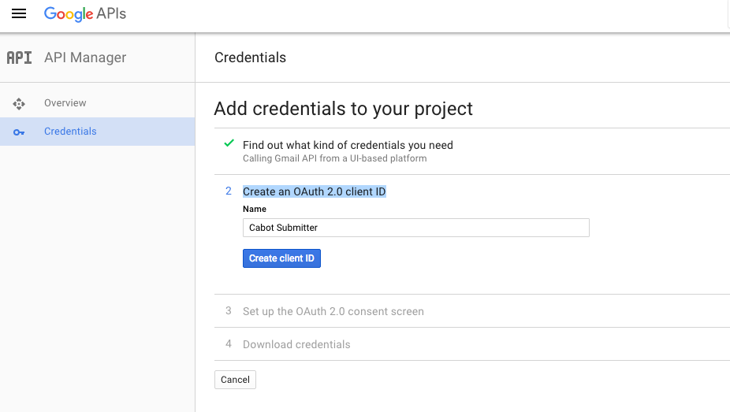
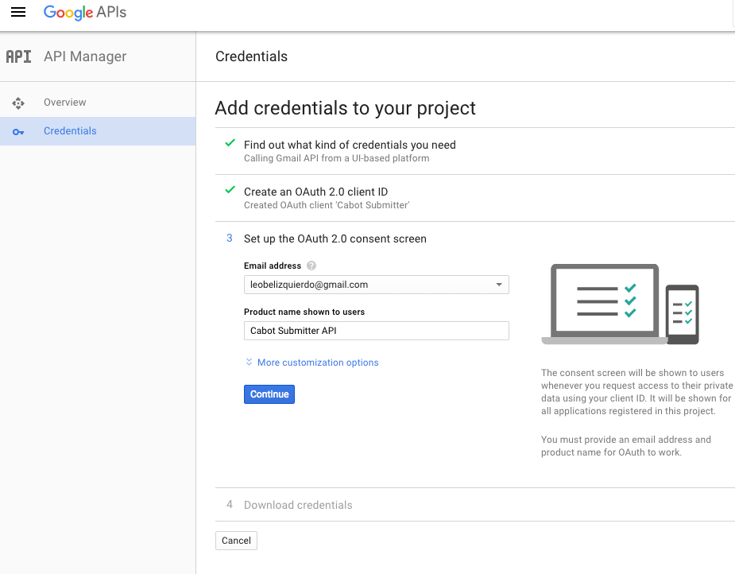
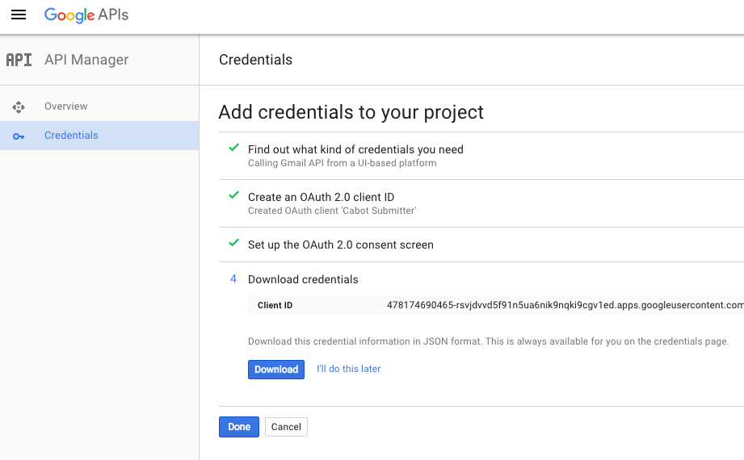
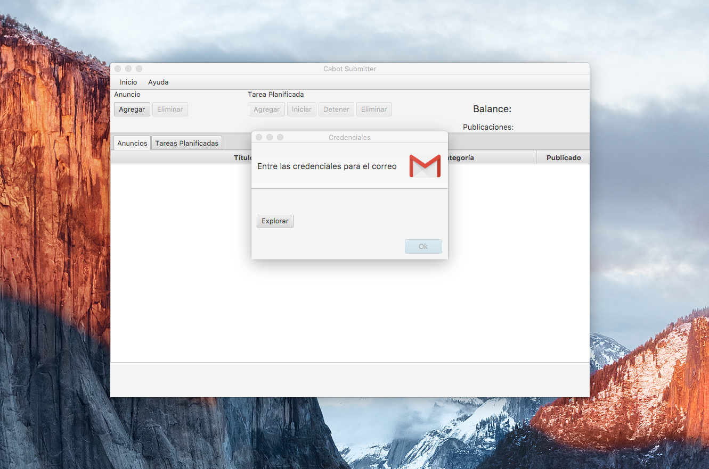
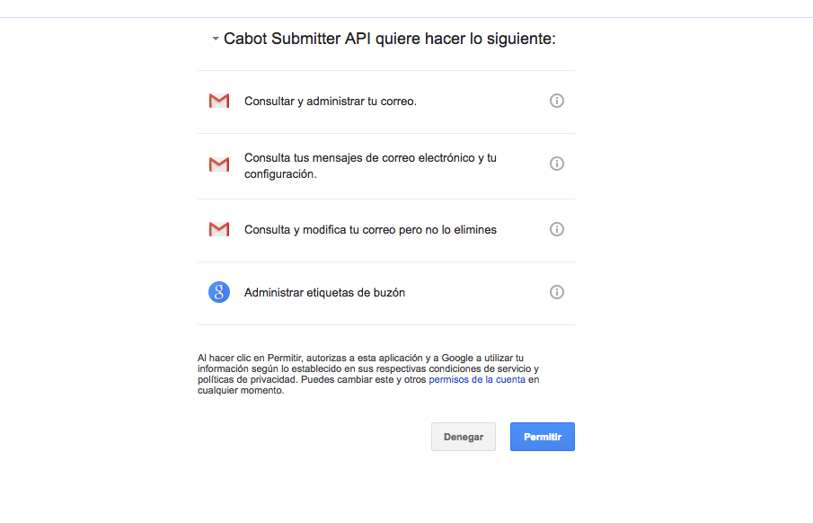
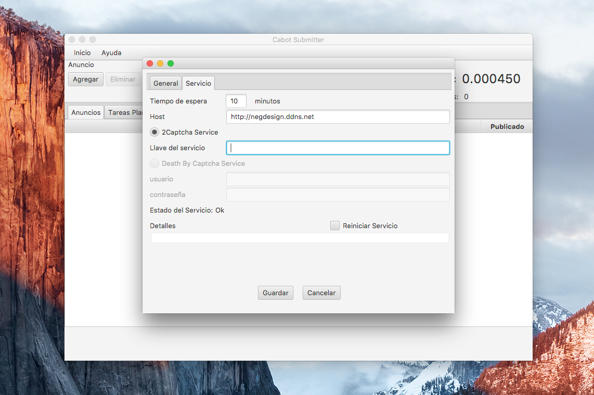

<strong>Welcome to Cabot Submitter!</strong> With this software you can submit advertisements in <a href="https://www.revolico.com" target="_blank">Revolico</a> automatically with minimal human supervision. So lets get start it!

<strong>Installation Guide</strong>

To install Cabot Submitter you need to have a gmail account. Once you have a gmail account (you can create one here: <a href="https://accounts.google.com/SignUp" target="_blank">https://accounts.google.com/SignUp</a>), next step is allow communication between Cabot Submitter and your gmail account. First you need to create a project in Google that use Gmail API, follow this link: <a href="https://console.developers.google.com/flows/enableapi?apiid=gmail&amp;pli=1" target="_blank">https://console.developers.google.com/flows/enableapi?apiid=gmail&amp;pli=1</a>  and create a new project. After you create the project it will say that the API is enable, now you need to set the right credentials, so click in the button (go to credentials). Next step is set up your project, you will see something like this:

Here you need to answer two questions.
<ul>
 	<li><strong>Where will you be calling the API from?</strong></li>
</ul>
select"Other UI (e.g. Windows, CLI tool)" in the combobox bellow
<ul>
 	<li><strong>What data will you be accessing?</strong></li>
</ul>
select "User data" in the radio button

Then click in the blue button (say: What credentials do I need?).

Next step is for add credentials to your project. You are creating credentials of type OAuth 2.0 and the set up for this require a name. Give a name to your client ID.. The step should looks like this:

&nbsp;

Now set the name to your product (this name will appear when you asking to allow Cabot Submitter to gain access to your email data), so try given a name that remind you the software, I recommend put it this name: "<strong>Cabot Submitter API</strong>". The step should looks like this:

Then click the Continue button.

At this stage you will complete the set up credentials process. All you have to do now is download the file generated clicking in the download button. The final stage looks like this:

&nbsp;

Alright! Now when the software run for first time you will see a dialog asking for the credentials need it to communicate with you email account. You will see something like this:

Find the credentials downloaded in the previous steps and select <strong>Ok</strong>. The software will open a new window in the browser that guide you through the google wizard that allow you give the right permission to the software. The final step is something like this:

&nbsp;

Click in the blue button and the software will have the right permissions! After start the software please go to <strong>Inicio&gt;Configuracíon</strong><strong>&gt;Servicio</strong>, you will see something like this:

In the focus textfield set the key provided by <a href="https://2captcha.com" target="_blank">2Captcha.com</a> and click in the button "Guardar".

Well that's all. I hope you enjoy it!
